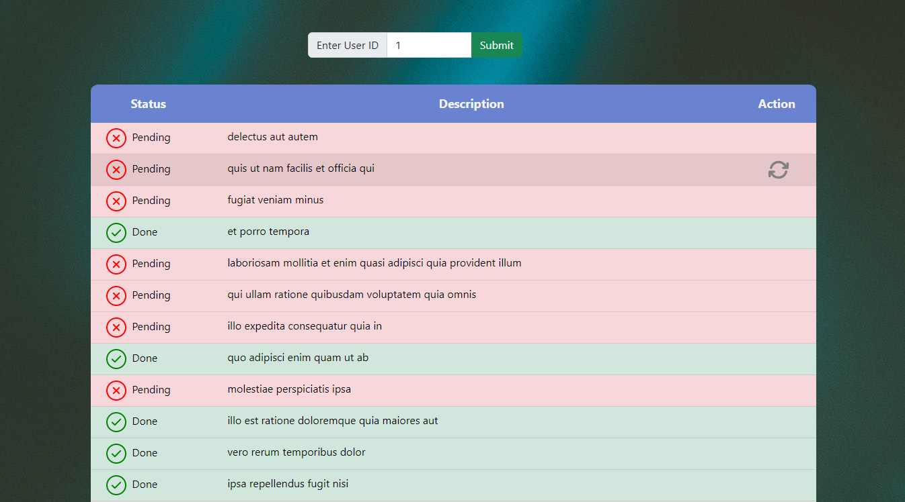

> By Dhruvil Prajapati
# ToDo-List_API App

This app get ToDo-List Data from server

## Functionality

- Fetch data from server ( https://jsonplaceholder.typicode.com/todos/ )
- Display data of selected user
- Change Status from Pending-->Done and vice-versa

### Screenshot

